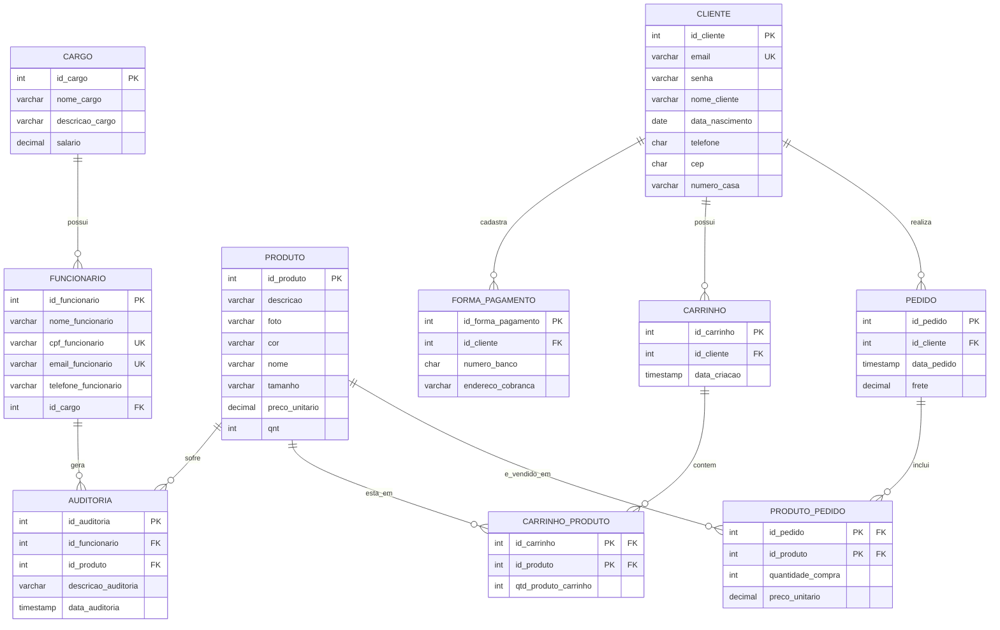

# Introdução

Em busca de retratar um problema que pode ser real de um cliente, nosso grupo buscou em plataformas de freelances alguma “dor” mercadologica que alguem estava passando. Na plataforma ***Workana***, pudemos encontrar um desafio que nos interessasse, apesar de sua simplicidade e valor oferecido. 

## O projeto:

> 
> 
> 
> **Sobre este projeto**
> 
> Estamos buscando um freelancer qualificado para desenvolver uma loja virtual completa para a venda de roupa íntima, incluindo lingeries, calcinhas e sutiãs. O foco principal é oferecer produtos confortáveis e de alta qualidade. O site deve ser intuitivo, com um design atraente e responsivo para garantir uma excelente experiência de compra em qualquer dispositivo (desktop, tablet, mobile).
> As funcionalidades essenciais incluem:
> 
> - Catálogo de produtos com fotos de alta resolução;
> - descrições detalhadas, opções de tamanho e cor.
> - Carrinho de compras funcional e seguro.
> - Integração com métodos de pagamento online (ex: cartões de crédito, boleto).
> - Sistema de gestão de pedidos e estoque.
> - Area de cadastro e login para clientes.
> - Ferramentas de busca e filtragem de produtos.
> - Otimização para motores de busca (SEO básico).
> 
> Buscamos um profissional com experiência comprovada em desenvolvimento de e-commerce, que possa entregar uma solução robusta e escalável. É Fundamental que o site reflita a qualidade e o conforto dos nossos produtos.
> 

Alguma das descrições relativas principalmente a aspectos de implementações tiverem que ser omitidas ao longo do desenvolvimento do projeto — Como o *design* *responsivo* e ser otimizado para ferramenta de buscas — mas por meio de uma interface simples e uma modelagem robusta do banco, fomos capazes de alcançar a maioria das exigencias do projeto — Apesar de ainda termos muito a evoluir

## A modelagem do banco de dados



# Dicionário de Dados

- Tabela cargo
    
    A tabela de cargos atua como uma entidade de domínio estrutural do sistema. Sua função é mapear a hierarquia organizacional da empresa responsável pelo ecommerce, armazenando as nomenclaturas oficiais das funções, suas respectivas descrições de atividades e o salário base estipulado para a posição. Esta tabela garante a padronização dos cargos atribuídos aos colaboradores.
    
- Tabela funcionario
    
    Esta entidade é responsável por gerenciar o quadro de colaboradores da empresa. Ela armazena informações de identificação pessoal, como nome e CPF, além de dados de contato (e-mail e telefone) com validações rigorosas de formato. Através de um relacionamento de chave estrangeira com a tabela cargo, o sistema define o papel de cada
    funcionário na operação do negócio, mantendo a integridade dos dados de recursos humanos.
    
- Tabela produto
    
    O núcleo do catálogo do e-commerce é representado por esta tabela. Ela centraliza todas as informações físicas e comerciais dos itens disponíveis para venda, incluindo nome, descrição, tamanho (limitado a uma grade padronizada), cor, preço atual de venda e quantidade disponível em estoque. Restrições do banco de dados garantem que não
    existam preços ou estoques com valores negativos, protegendo a lógica comercial da loja.
    
- Tabela auditoria
    
    Projetada para garantir a rastreabilidade e a segurança do sistema, a tabela de auditoria funciona como um log de eventos. Ela registra alterações, atualizações ou inspeções sistêmicas, vinculando cada evento a um produto ou a um cargo, juntamente com
    uma descrição textual e o registro exato de data e hora (timestamp). Isso permite aos gestores monitorar o histórico de modificações no banco de dados.
    
- Tabela cliente
    
    Esta tabela armazena o cadastro dos usuários finais da plataforma (compradores). Ela consolida informações críticas de acesso (e-mail único e senha) e dados demográficos essenciais para a operação comercial, como data de nascimento, telefone e endereço (CEP e número). A entidade utiliza expressões regulares para garantir que os dados de contato sejam inseridos no formato correto, garantindo a comunicação eficiente com o consumidor.
    
- Tabela forma_pagamento
    
    Destinada ao módulo financeiro do cliente, esta entidade armazena os métodos de pagamento (como cartões de crédito ou contas) cadastrados pelos usuários. Ela possui uma forte dependência da tabela cliente, configurada de modo que, caso o registro de um usuário seja removido da plataforma, todos os seus dados sensíveis de pagamento sejam automaticamente excluídos em cascata, respeitando princípios de privacidade de dados.
    
- Tabela carrinho
    
    A tabela de carrinho atua como o cabeçalho de uma sessão de comprasem andamento. Ela registra o momento exato em que um cliente inicia a intenção de compra na loja virtual. Sendo uma entidade de transição, ela prepara o terreno para agrupar os itens desejados antes que eles se tornem um pedido definitivo.
    
- Tabela carrinho_produto
    
    Trata-se de uma entidade associativa que resolve o relacionamento de muitos-para-muitos entre carrinhos e produtos. Sua função é listar os itens específicos que um cliente colocou em seu carrinho de compras e a quantidade desejada de cada um. Ela foi modelada para garantir que, caso o carrinho seja esvaziado ou o produto descontinuado, a associação seja desfeita sem deixar dados residuais no sistema.
    
- Tabela pedido
    
    A entidade de pedido consolida a conversão de um carrinho em uma compra formalizada. Ela gera um identificador único para a transação, registra a data exata da finalização do checkout e armazena o custo do frete calculado para a entrega. O relacionamento com a tabela de clientes é restrito, impedindo que um cliente seja excluído do banco de dados se ele possuir um histórico de pedidos finalizados, o que preserva a integridade contábil e fiscal do e-commerce.
    
- Tabela produto_pedido
    
    Esta é a tabela mais crítica para a integridade financeira do histórico de vendas. Como uma entidade associativa entre pedidos e produtos, ela não apenas lista os itens comprados e suas quantidades, mas funciona como um "retrato" (snapshot) da transação. Ao registrar o preco_unitario do item no momento exato da compra, ela assegura que futuras flutuações no valor do produto na tabela principal não alterem retrospectivamente o valor total dos recibos e notas fiscais já emitidos aos clientes.
    

## As functions

### **Function `verificar_estoque_critico`**

Realizar uma varredura (varredura de inventário) automatizada na tabela de produtos para identificar e alertar o administrador sobre itens que atingiram um nível crítico de escassez.

- **Parâmetro de Entrada:** Recebe um número inteiro que define o limite numérico do que a empresa considera "estoque crítico".
- **Retorno :** Como o objetivo principal é disparar uma ação/aviso interno e não devolver um dado bruto, ela é declarada como `VOID` (sem retorno). No PostgreSQL, funções com retorno `VOID` funcionam de forma análoga a uma `PROCEDURE`.
- **A Estrutura de Loop :** A função abre um cursor implícito usando a variável especial `v_reg` do tipo `RECORD` (um tipo de dados dinâmico que consegue moldar-se a qualquer linha de resultado). O loop executa um `SELECT` filtrando os produtos cujo estoque está abaixo do limite informado.
- **O Alerta:** Para cada linha encontrada pela query, o loop pausa, captura o nome do produto através de `v_reg.nome` e envia uma mensagem de console em tempo real para o sistema.

**Análise do Teste 1:**

Ao executar `SELECT verificar_estoque_critico(40);`, o banco percorre todos os produtos. No conjunto de dados que inserimos anteriormente, os produtos como *Vestido de Verão* (estoque 30), *Jaqueta de Couro* (15), *Blusa de Frio* (25) e *Casaco Corta-Vento* (20) farão o loop disparar quatro alertas consecutivos no console do seu gerenciador (DBeaver/pgAdmin).

### **Function `obter_categoria_cliente`**

Transformar o histórico de compras de um cliente em uma classificação estratégica de marketing (CRM), categorizando-o em níveis de fidelidade com base no seu volume financeiro acumulado.

- **Parâmetro de Entrada (`p_id_cliente`):** Recebe o ID do cliente que se deseja analisar.
- **Cálculo de Consumo (`SELECT INTO`):** Cruza a tabela de `pedido` com `produto_pedido` para somar todo o dinheiro que o cliente já movimentou no e-commerce. A função `COALESCE(..., 0)` é usada estrategicamente para garantir que, se um cliente for novo e nunca tiver comprado nada, o resultado seja `0` em vez de `NULL` (o que quebraria as validações matemáticas adiante).
- **Estrutura Condicional (`IF / ELSIF / ELSE`):** O valor armazenado em `v_total_compra` passa por um funil de decisões:
    1. Se gastou mais de R$ 1000.00  Retorna `'Cliente: VIP'`.
    2. Se gastou entre R$ 500.01 e R$ 1000.00  Retorna `'Cliente: PLATINUM'`.
    3. Qualquer valor abaixo dissoRetorna `'Cliente: STANDART'`.

**Análise do Teste 2:**

Ao executar `SELECT obter_categoria_cliente(1);`, a função avalia as compras do Cliente 1 (Calebe). No nosso histórico, ele possui o Pedido 1, que soma R$ 99,80 em produtos. Como esse valor cai na última condição do funil, a função retorna com sucesso a string `'Cliente: STANDART'`.

### **Function `calcular_total_pedido`**

**Objetivo Central:** Centralizar a regra de negócio matemática que calcula o custo total final de uma nota de venda, consolidando o somatório de todos os produtos adquiridos adicionado à taxa de entrega (frete).

- **Parâmetro de Entrada:** Recebe o código identificador do pedido que precisa ser faturado.
- **Retorno:** Devolve um valor monetário exato e preciso para o sistema chamador.
- **Agregação e Junção Externa:** A query une os itens comprados com os dados gerais do frete . A expressão matemática executa a multiplicação interna de quantidade por preço, agrupa pelo frete do pedido usando `GROUP BY p.frete` e realiza a soma final: `SUM(quantidade * preço) + frete`.
- **Retorno da Variável:** O resultado exato da conta é injetado na variável local `v_total` e enviado como resposta da consulta.

**Análise do Teste 3:**
Ao executar `SELECT calcular_total_pedido(1);`, o motor do banco calcula o Pedido 1: duas Camisetas Básicas (2 × R$ 49,90 = R$ 99,80) mais o frete registrado para esse pedido (R$ 15,50). O resultado final devolvido de forma limpa pela função é **`115.30`**.

### As triggers

### 1. Trigger `trigger_validar_estoque_carrinho` (Módulo de Vendas)

**Objetivo Central:** Atuar como uma barreira de segurança automatizada, impedindo que um cliente adicione ao carrinho uma quantidade de produtos maior do que a empresa possui fisicamente no estoque.

### Como ela funciona passo a passo:

- **Momento do Disparo (`BEFORE INSERT OR UPDATE`):** O gatilho é acionado **antes** que o dado seja efetivamente gravado ou modificado na tabela `carrinho_produto`. Isso é estratégico: se houver um erro, o banco barra a operação antes de gastar recursos processando a gravação.
- **Captura do Cenário (`SELECT INTO`):** A função captura o ID do produto que está sendo solicitado (através da variável especial `NEW.id_produto`) e busca na tabela `produto` qual é a quantidade real disponível em estoque (`qnt`), guardando o valor na variável `estoque_atual`.
- **A Condicional (`IF`):** O sistema compara o valor que o usuário quer colocar no carrinho (`NEW.qtd_produto_carrinho`) com o `estoque_atual`.
- **O Bloqueio (`RAISE EXCEPTION`):** Se a quantidade solicitada for maior que a disponível, a trigger cancela imediatamente toda a transação com um comando de erro personalizado. Nenhuma linha é inserida e o banco faz um *rollback* automático.
- **Retorno (`RETURN NEW`):** Se o estoque for suficiente, a validação passa e o registro segue para ser salvo normalmente.

### Análise do Teste 1:

Ao tentar rodar o comando `INSERT INTO carrinho_produto ... VALUES (1, 1, 200);`, como o produto ID 1 foi cadastrado anteriormente com apenas 100 unidades em estoque, a trigger barra o comando e exibe na tela a mensagem exata:

> *Estoque insuficiente para (ID: 1). Disponível: 100, Solicitado: 200.*
> 

### 2. Trigger `trigger_auditoria_produto` (Módulo de Catálogo e Estoque)

**Objetivo Central:** Criar um histórico imutável (log) de todas as ações importantes realizadas no catálogo de produtos. Ela rastreia quem nasce, quem muda e quem morre no sistema.

- **Momento do Disparo (`AFTER INSERT OR UPDATE OR DELETE`):** Ao contrário da primeira, esta roda **depois** que a ação já foi consolidada com sucesso na tabela `produto`. Faz sentido, pois só devemos auditar o que realmente aconteceu.
- **Identificação do Evento (`TG_OP`):** A variável especial `TG_OP` (Trigger Operation) descobre qual comando disparou o gatilho (`INSERT`, `UPDATE` ou `DELETE`) e direciona o código para o bloco correto:
    - **Cenário `INSERT`:** Quando um novo produto é criado, a trigger captura seus dados (`NEW.nome` e `NEW.preco_unitario`) e insere uma linha descritiva na tabela `auditoria` com a data/hora exata do servidor (`NOW()`).
    - **Cenário `UPDATE` (Otimizado):** Para evitar entupir o banco com logs desnecessários (como alterar apenas a foto ou a cor do produto), o `IF` usa a cláusula `IS DISTINCT FROM` para verificar se o preço ou a quantidade mudaram. Se mudaram, ela grava no log o "passado" do produto (usando `OLD.`) e o "presente" do produto (usando `NEW.`).
    - **Cenário `DELETE`:** Se alguém excluir um produto, os dados dele sumiriam para sempre. A trigger intercepta isso usando a variável `OLD` (que guarda as informações do registro que está prestes a morrer) e salva o nome do item deletado na tabela de auditoria antes que ele desapareça.

### Análise do Teste 2:

Ao executar o comando `UPDATE produto SET preco_unitario = 55.00, qnt = 90 WHERE id_produto = 1;`, a tabela de auditoria ganha automaticamente uma nova linha registrando o preço antigo (R$ 49.90) e o estoque antigo (100) contra os novos valores. O `SELECT * FROM auditoria;` comprova o sucesso do rastreamento.

## As views

### View `funcionario_cargo`

**Objetivo Central:** Simplificar o acesso à folha de colaboradores da empresa, ocultando a complexidade do relacionamento de chaves estrangeiras e omitindo dados sensíveis dos funcionários (como CPF e Telefone).

- **A Estrutura Interna (`INNER JOIN`):** A visão realiza o cruzamento clássico entre as tabelas `funcionario` e `cargo` através do campo em comum `id_cargo`.
- **Abstração de Dados:** Ela filtra a junção para projetar apenas duas colunas na tela: o nome do colaborador e o nome do cargo dele.

#### Análise do Teste 1:

Ao executar `SELECT * FROM funcionario_cargo;`, em vez de você ter que digitar toda a sintaxe do `JOIN` e da cláusula `ON`, você consulta a View como se ela fosse uma tabela comum de duas colunas. O banco de dados resolve o relacionamento por baixo dos panos e exibe a lista limpa (ex: *Carlos Silva* | *Gerente de Vendas*).

### View `tamanho_produto`

**Objetivo Central:** Criar um atalho ou subset de dados focado estritamente em uma regra de negócio específica do inventário — neste caso, isolar os produtos de tamanho "Extra Grande" (`gg`).

- **Restrição por Cláusula `WHERE`:** Esta View atua diretamente sobre uma única tabela . Ela limita o conjunto de resultados através do filtro `WHERE tamanho = 'gg'`.
- **Projeção de Colunas:** Ela seleciona apenas o nome, o ID e o tamanho do item, deixando de lado colunas como preço, cor, quantidade em estoque ou foto.

#### Análise do Teste 2:

Ao rodar `SELECT * FROM tamanho_produto;`, o sistema trará apenas os registros que atendem ao critério "gg" (no caso dos dados de exemplo, a *Jaqueta de Couro* e o *Casaco Corta-Vento*). Isso é extremamente útil na faculdade para demonstrar como criar **Views de Segurança**, onde usuários com menos privilégios só podem enxergar fatias específicas de uma tabela.

### View `fechamento_financeiro` (Módulo Contábil e de Vendas)

**Objetivo Central:** Encapsular um cálculo analítico complexo de faturamento. Ela transforma linhas de itens vendidos em relatórios consolidados de receita por venda de forma imediata.

- **Cálculo Agregado e Expressão Matemática:** A View realiza a multiplicação interna de `quantidade_compra * preco_unitario` para cada item de um pedido, soma todos eles através do `SUM()` e adiciona o valor do frete (`+ pedido.frete`).
- **Consolidação por `GROUP BY`:** Para que a função de agregação funcione corretamente sem misturar os pedidos, o banco de dados agrupa os resultados pelo identificador do pedido e pelo valor do frete (`GROUP BY pedido.id_pedido, pedido.frete`).

#### Análise do Teste 3:

Ao executar `SELECT * FROM fechamento_financeiro;`, o banco gera um relatório financeiro dinâmico com o ID do pedido, o frete aplicado e a coluna calculada `valor_total_pedido`. O usuário final ou o sistema de relatórios não precisa saber como a matemática da venda foi feita; a View entrega o valor final mastigado.

# Implementação

### Tecnologias Utilizadas

O projeto é uma aplicação web interativa focada em banco de dados, construída com as seguintes tecnologias:

- **Python:** A linguagem de programação principal utilizada em todo o backend e lógica da aplicação.
- **Streamlit:** O framework utilizado para criar a interface gráfica web (frontend) de forma rápida e totalmente em Python, responsável pelas abas, botões, formulários e navegação entre páginas.
- **PostgreSQL:** O Sistema de Gerenciamento de Banco de Dados Relacional (SGBD) escolhido para armazenar e persistir os dados da loja.
- **Psycopg2:** Biblioteca/driver em Python utilizado em `main.py` para estabelecer a conexão direta com o PostgreSQL, realizar o login e cadastrar clientes.
- **SQLAlchemy:** Biblioteca utilizada nas outras páginas (como `adm.py`, `produtos.py` e `carrinho.py`) em conjunto com o recurso `st.connection` do Streamlit para enviar comandos SQL (como `INSERT`, `UPDATE` e `SELECT`) e lidar com transações.
- **Pandas:** Biblioteca de manipulação de dados utilizada para receber os resultados das consultas SQL e exibi-los formatados como tabelas (DataFrames) na interface de administração.

### O que você precisa fazer para rodar o projeto

Para testar este projeto localmente, você precisará preparar o ambiente de banco de dados e o ambiente Python. Siga os passos abaixo:

### Passo 1: Preparar o Banco de Dados (PostgreSQL)

1. Você deve ter o **PostgreSQL** instalado e rodando no seu computador (geralmente na porta padrão `5432`).
2. Crie um banco de dados chamado **`ecommerce`**.
3. Certifique-se de que o usuário seja **`postgres`** e a senha seja **`1234`**, ou altere as credenciais no arquivo `main.py` (dentro da função `conectar_banco()`) para corresponderem às suas configurações locais.
4. **Criar as Tabelas e Funções:** O código em Python não cria as tabelas automaticamente. Você precisará rodar um script SQL (DDL) no seu PostgreSQL para criar as seguintes estruturas mencionadas no código:
    - Tabelas: `cliente`, `produto`, `carrinho`, `carrinho_produto`, `pedido`, `produto_pedido`, `funcionario`, `auditoria`.
    - Views: `funcionario_cargo`, `tamanho_produto`, `fechamento_financeiro`.
    - Funções (Functions/Procedures): `verificar_estoque_critico()`, `obter_categoria_cliente()`.
  
<aside>
💡

Durante a implementação da interface grafica e backend notou-se um erro estrutural de modelagem do banco de dados onde:

- A tabela auditoria continha uma chave estrangeira para tabela “cargos” ao invés da tabela “funcionários”

Assim não era possível identificar o responsável pela auditoria das tabelas produto, quebrando uma regra de negocio. Para contornar este erro foi executado o script:

```sql
alter table auditoria drop constraint fk_auditoria_adm;
alter table auditoria 
add constraint 
 fk_auditoria_adm foreign key(id_cargo)
	references funcionario(id_funcionario);

alter table auditoria rename column id_cargo to id_funcionario;
```

</aside>

### Passo 2: Preparar o Ambiente Python

1. Certifique-se de ter o Python (versão 3.8 ou superior) instalado.
2. Abra o terminal na pasta onde os arquivos `.py` estão salvos.
3. Instale as bibliotecas necessárias rodando o seguinte comando no terminal:

```powershell
pip install streamlit psycopg2-binary sqlalchemy pandas
```

### Passo 3: Executar o Projeto

1. Com tudo instalado e o banco de dados rodando, abra o terminal na pasta do projeto.
2. Inicie a aplicação utilizando o comando do Streamlit no arquivo principal de roteamento:

```powershell
streamlit run main.py
```

<aside>
💡

- *(Nota: o arquivo `main.py` gerencia a navegação entre as páginas `main.py`, `adm.py`, `produtos.py` e `carrinho.py`)*
</aside>

- O seu navegador abrirá automaticamente em uma aba `http://localhost:8501`, onde você verá a tela de login inicial. Você poderá logar como administrador usando o e-mail `admin@loja.com` e a senha `1234`.

## Visão Geral da Arquitetura

A aplicação adota um modelo onde o Streamlit atua diretamente na camada de apresentação e controle, comunicando-se com o banco de dados PostgreSQL por meio de drivers de conexão (`psycopg2` e `SQLAlchemy`).

- **Frontend:** Interface Web reativa gerada dinamicamente pelo Streamlit.
- **Backend / Lógica:** Scripts Python que realizam o controle de sessões (`st.session_state`), validações e mapeamento de rotas.
- **Persistência (BD):** Banco de dados relacional hospedado localmente (`localhost`), contendo tabelas, restrições (*constraints*), *views* e funções/procedimentos.

## Fluxo de Navegação e Módulos

O ecossistema do código é composto por uma página principal de controle de acesso (`main.py`) que gerencia dinamicamente os demais submódulos (`produtos.py`, `carrinho.py`, `adm.py`) de acordo com o nível de permissão do usuário logado.

### Controle de Acesso e Sessão (`main.py`)

Responsável por inicializar o estado da aplicação e gerenciar a autenticação.

- **Mecanismo de Login:**
    - **Administrador:** Verificado via código (*hardcoded* com e-mail `admin@loja.com` e senha `1234`). Libera o menu completo incluindo a aba de "Administração".
    - **Cliente:** Consulta a tabela `cliente` por meio de uma consulta parametrizada tradicional (`SELECT nome_cliente FROM cliente WHERE email = %s AND senha = %s`). Caso encontre o registro, armazena o nome na sessão e libera o menu de compras.
- **Cadastro de Clientes:** Fornece um formulário (`st.form`) que realiza uma inserção direta (`INSERT INTO cliente...`) no banco de dados. Conta com tratamento de exceções para capturar erros vindos do PostgreSQL (ex: violação de chave única ou e-mail duplicado).

### Módulo de Vitrine (`produtos.py`)

Interface destinada à visualização e seleção de produtos pelos clientes.

- **Busca Dinâmica:** Utiliza a cláusula `ILIKE` do SQL para permitir buscas parciais e insensíveis a maiúsculas/minúsculas filtrando pelo nome do produto.
- **Persistência do Carrinho (Upsert):** Ao clicar em "Adicionar Carrinho", o sistema verifica se já existe um carrinho ativo na sessão. Caso contrário, cria um novo registro na tabela `carrinho`. Em seguida, executa uma instrução de **Upsert** na tabela pivô `carrinho_produto`:
    
    ```powershell
    INSERT INTO carrinho_produto (id_carrinho, id_produto, qtd_produto_carrinho) 
    VALUES (:carrinho, :produto, 1)
    ON CONFLICT (id_carrinho, id_produto) 
    DO UPDATE SET qtd_produto_carrinho = carrinho_produto.qtd_produto_carrinho + 1;
    ```
    

### Módulo de Checkout (`carrinho.py` ou `pages/carrinho.py`)

Aba responsável por listar os itens selecionados e simular o fechamento de uma venda.

- **Junções (JOINs):** Realiza um `INNER JOIN` entre as tabelas `carrinho_produto` e `produto` para extrair os detalhes visualizáveis do item (nome, preço e quantidade selecionada) com base no ID do carrinho atual.
- **Transação Financeira (Checkout):** A finalização da compra simula o fechamento do pedido de forma transacional (`with conexao.session as s`):
    1. Cria um registro na tabela `pedido` recuperando o ID gerado via `RETURNING id_pedido`.
    2. Varre os itens do carrinho e os insere na tabela de histórico/itens `produto_pedido`.
    3. Remove os itens do carrinho temporário (`DELETE FROM carrinho_produto...`).
    4. Executa o `s.commit()` garantindo a atomicidade da operação (ou faz *rollback* implícito em caso de falha).

### Painel de Administração (`adm.py`)

Módulo exclusivo para usuários administradores, focado na gerência de dados e auditoria do sistema. Está dividido em três abas (*Tabs*):

- **Aba 1: Editar Produtos (Operação de UPDATE)**
    - Permite alterar as propriedades de um produto existente (nome, descrição, cor, tamanho, preço) com base no ID fornecido.
    - *Gatilho / Auditoria Manual:* Se a linha for alterada com sucesso (`resultado.rowcount != 0`), o sistema realiza voluntariamente um `INSERT` na tabela `auditoria`, registrando o log da alteração, simulando o comportamento de uma *Trigger* de auditoria de aplicação.
- **Aba 2: Funções Básicas e Views**
    - **Execução de Stored Procedures / Functions:** Realiza a chamada de funções armazenadas no PostgreSQL via comando `SELECT verificar_estoque_critico(:n)` e `SELECT obter_categoria_cliente(:n)`.
    - **Consumo de Views:** Realiza consultas diretas a abstrações de tabelas (Views do Banco de Dados) criadas para simplificar relatórios acadêmicos:
        - `funcionario_cargo` (Relatório de RH).
        - `tamanho_produto` (Filtro específico por tamanho).
        - `fechamento_financeiro` (Relatório consolidado de vendas).
- **Aba 3: Logs de Administrador**
    - Exibe um relatório gerado a partir de múltiplos `JOINs` entre três tabelas (`funcionario`, `auditoria` e `produto`), evidenciando qual funcionário modificou qual produto e qual foi a descrição da ação.
